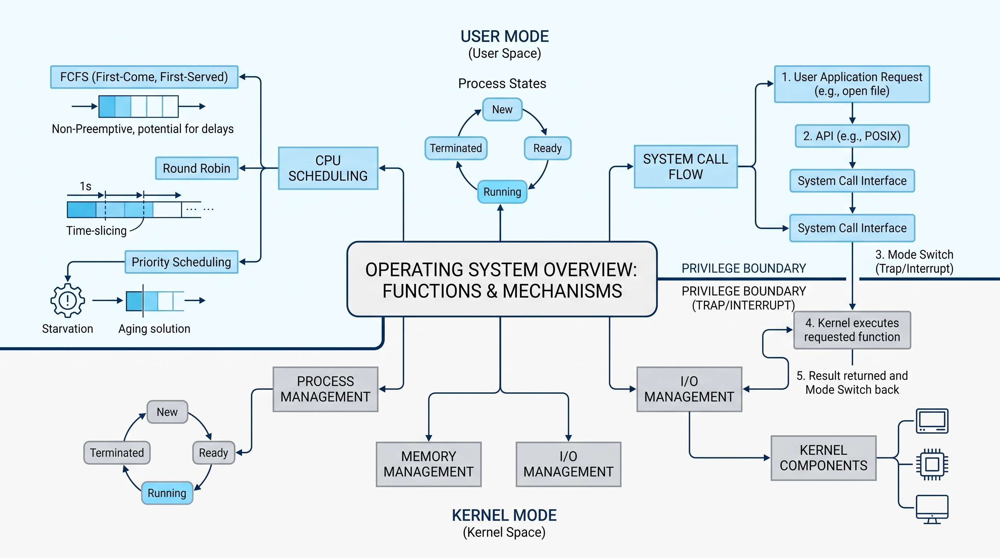

# Diário de Bordo: O Dilema do Servidor em Nuvem - CloudData

## Parte A: Entendendo a Barreira do Sistema (Chamadas de Sistema)

**1. Como o processo solicita essa leitura ao Sistema Operacional?**
O processo realiza essa solicitação através de uma **System Call (Chamada de Sistema)**. Por não ter permissão para acessar o disco diretamente por questões de segurança e controle, a aplicação de Geração de Relatório invoca uma interface de programação oferecida pelo Sistema Operacional (como as chamadas `read()` ou `open()`) para que o SO acesse o hardware em seu nome.

**2. Mudança de modo de acesso (Modo Usuário vs. Modo Kernel)**
Quando o processo faz a System Call, ocorre uma interrupção de software (conhecida como *trap* ou exceção). O processador interrompe a execução no **Modo Usuário** (um estado restrito, onde o processo não tem acesso direto aos periféricos) e realiza uma mudança de contexto (*context switch*) para o **Modo Kernel** (estado com privilégios totais de hardware). No Modo Kernel, o Sistema Operacional executa a rotina de leitura no disco de forma segura e, ao finalizar, retorna os dados para o processo, voltando a CPU para o Modo Usuário.

---

## Parte B: Diagnosticando o Escalonador

**1. Por que o algoritmo FCFS está causando o "congelamento"?**
O FCFS (*First-Come, First-Served*) executa os processos estritamente na ordem em que chegam à fila. Como os processos *Batch* (Geração de Relatórios) requerem muito tempo de CPU para processamento pesado, eles monopolizam o processador. Isso causa o "efeito comboio" (*convoy effect*), onde processos interativos rápidos (requisições web) ficam travados na fila aguardando a finalização dos processos longos, resultando no congelamento perceptível da interface para os usuários.

**2. O que significa FCFS ser "Não Preemptivo" e como isso afeta a CPU?**
Um algoritmo "Não Preemptivo" significa que o Sistema Operacional **não pode retirar forçadamente** a CPU de um processo que está em execução. O escalonador deve aguardar até que o processo libere a CPU voluntariamente (terminando sua execução ou bloqueando-se para aguardar uma operação de I/O, como leitura de disco). No cenário da CloudData, a CPU fica "refém" da tarefa de relatório pesado, impedindo o SO de parar temporariamente essa tarefa para atender rapidamente uma requisição da interface web.

---

## Parte C: Propondo a Solução

**1. Algoritmo mais adequado: Round-Robin (RR)**
Para resolver o problema de responsividade da interface web, o **Round-Robin** é o algoritmo ideal. 
* **Justificativa técnica:** O Round-Robin é um algoritmo **preemptivo**. Ele estabelece uma "fatia de tempo" (chamada de *Quantum*) igual para todos os processos. Se a tarefa de relatório estiver rodando e seu tempo limite expirar, o Sistema Operacional suspende o processo temporariamente (fazendo preempção) e repassa a CPU para o próximo processo da fila, que pode ser uma requisição web interativa. Dessa forma, as requisições dos usuários nunca esperam muito tempo para serem processadas, garantindo um sistema altamente responsivo.

**2. O que é Starvation e como evitar?**
* **Starvation (Inanição):** Caso seja adotado um algoritmo de prioridades onde a web é sempre preferencial, processos de baixa prioridade (como a geração de relatórios batch) podem nunca receber tempo de CPU, já que novas requisições web podem não parar de chegar, bloqueando os relatórios infinitamente. 
* **Mecanismo de solução:** Para evitar isso, o SO utiliza a técnica de **Aging (Envelhecimento)**. O *Aging* aumenta gradativamente a prioridade de um processo de acordo com o tempo que ele passa aguardando na fila. Eventualmente, mesmo um processo de relatório (baixa prioridade) atingirá a prioridade máxima temporariamente e terá sua execução garantida pelo escalonador.

---

## Instrumento Visual de Síntese

O diagrama abaixo consolida o fluxo lógico estabelecido na pesquisa multimídia: conecta como os **Processos Interativos e Batch** interagem na barreira de proteção via **System Calls (Modo Kernel/Usuário)**, gerando gargalos sob políticas não preemptivas e exigindo preempção através de escalonadores como o **Round-Robin** para melhorar o tempo de resposta.

---

## Referências Bibliográficas

**Vídeo (Aula Universitária):**
UNIVESP. **Sistemas Operacionais – Aula 03 - Chamada de Sistema e Interrupção**. YouTube, 2 jun. 2014. Disponível em: <https://www.youtube.com/watch?v=b73A4DBXl18>. Acesso em: 1 out. 2026.

**Áudio (Podcast sobre Infraestrutura/Servidores):**
HIPSTERS PONTO TECH. **Locaweb: Cloud, hosting e soberania de dados no Brasil – Hipsters Ponto Tech #529**. Podcast. 18 ago. 2026. Disponível em: <https://www.hipsters.tech/locaweb-cloud-hosting-e-soberania-de-dados-no-brasil-hipsters-ponto-tech-529/>. Acesso em: 1 out. 2026.

**Texto (Artigo Técnico e Livro Base):**
MORSCH, S. **Sistemas Operacionais: Escalonamento de Processos**. Medium, 25 maio 2023. Disponível em: <https://medium.com/@samuelmorschh/sistemas-operacionais-3558bfe07576>. Acesso em: 1 out. 2026.

SILBERSCHATZ, A.; GALVIN, P. B.; GAGNE, G. **Fundamentos de Sistemas Operacionais**. 9. ed. Rio de Janeiro: LTC, 2015.